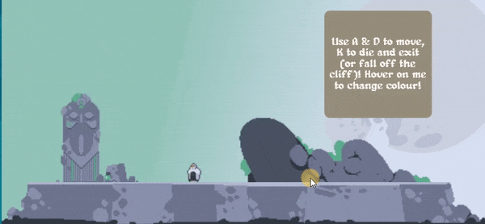
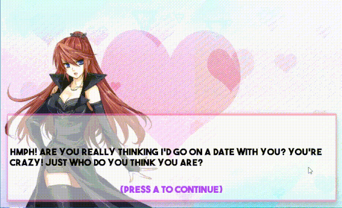
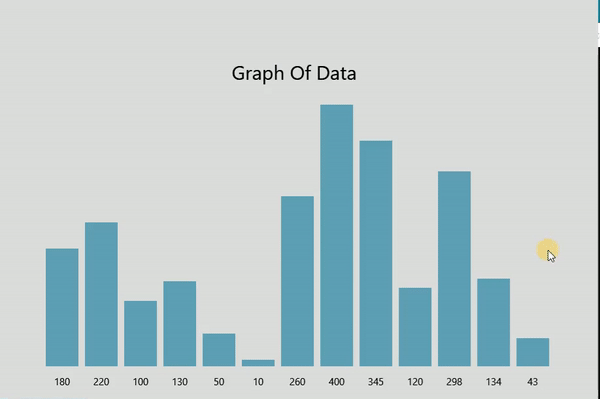
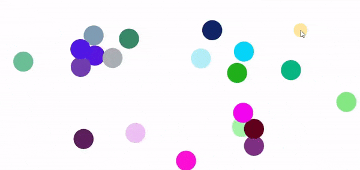

<p align="center">
  
</p>
<p align="center">
  <b>Batch Game Engine with Real Graphics, Mouse/Keyboard Input, and Audio, without External Exes</b>
</p>


## Features

* Simple to include, just copy & paste!
* Supports images, sprites, shapes, text
* Supports keyboard and mouse input, including hover, dehover, and click
* Supports audio and related functions
* No external exes, contained within a single batch file
* Ideal Uses : simple simulations, non input-driven games, GUI, ect
* Works out-of-the-box with Windows 7 (with IE 9+ installed) and up

## Drawbacks

* Hard to debug
* Not beginner friendly
* Uses Batch

## Getting Started

Visit the documentation [here](doc/README.md) and look at the examples [here](ex)!

## Showcase



```
textbox

simple platforming

mouse/key input

sprites
```

<br clear="left"/>



```
textbox

visual novel

key input
```

<br clear="left"/>



```
textbox

data visualization

mouse/key input
```
<br clear="left"/>



```
particle system
```
<br clear="left"/>
